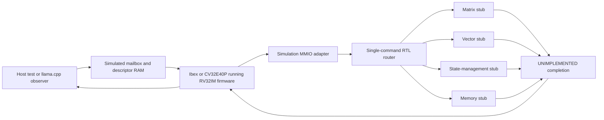

# RTL integration harness

This harness boots existing RISC-V cores, sends commands to replaceable RTL
stubs, and checks how software handles an unimplemented accelerator. It is an
integration proposal for [soc #4](https://github.com/SiliconBadgers/soc/issues/4).
It does not select a CPU or implement the controller proposed in
[rtl-control #5](https://github.com/SiliconBadgers/rtl-control/pull/5).

## What is connected

The cores, register files and accelerator router are Verilated RTL. The mailbox,
64 KiB RAM, MMIO decoder and descriptor reads are C++ simulation models. There is
no implemented host link, RTL register bank, DMA, shared SRAM, interrupt service
or tensor datapath. The CPU instruction/data ports use the same clock as the
router. Production clock, reset and bus integration remain open.

The [central architecture diagram](https://github.com/SiliconBadgers/architecture/blob/main/docs/accelerator-diagram.md)
and [system boundaries](https://github.com/SiliconBadgers/architecture/blob/main/contracts/system-boundaries-and-evidence.md)
remain the design references. This diagram describes only the runnable test.

## RTL boundaries and style

| Component | Current behavior | Work left to the owning component |
|---|---|---|
| `riscv_wrapper` | Selects upstream Ibex or CV32E40P and exposes separate instruction/data ports | CPU choice, production wrapper, interrupts, debug, bus errors, boot and reset integration |
| `command_router` | One accepted command at a time, routes by test opcode, holds ownership until completion is consumed | Replace with the reviewed top-level control implementation |
| `u_matrix` | Returns `UNIMPLEMENTED` | Matrix computation, quantization and data movement |
| `u_vector` | Returns `UNIMPLEMENTED` | Vector operations, formats and scheduling |
| `u_state` | Returns `UNIMPLEMENTED` | State storage, ordering and lifetime rules; dedicated recurrence arithmetic is not selected |
| `u_memory` | Returns `UNIMPLEMENTED` | SRAM organization, requests, responses, arbitration and DMA |

`command_router_test_top` connects the router to its fixtures.
All four datapath boundaries currently instantiate `engine_stub`. They are
named replacement points, not four working engines. There are deliberately no
invented SRAM ports or numeric-format parameters before those contracts exist.

Use these conventions for contributions to this boundary:

- SystemVerilog packages for shared types; `_i` and `_o` for ports, `_q` for stored
  state; explicit signal widths and named port connections.
- Commands transfer only on `valid && ready`. The sender holds the payload until
  acceptance. Completion payloads remain stable while backpressured.
- `idle_o` means there is no owned command, including an unconsumed completion.
  `quiesce_i` stops new acceptance and permits the current completion to drain.
- Active-low asynchronous reset clears this stub's state. That is not a safe
  production reset protocol for outstanding writes or DMA.
- A stub must never report successful arithmetic or modify output tensors.
  Unsupported operations and unsupported ABI versions return a terminal error.
- Add a test for a changed interface behavior. Keep implementation and physical
  performance claims separate from interface tests.

## Provisional command adapter

`command_t` carries sequence/context IDs, ABI/opcode, four addresses, dimensions,
strides and a format ID. It is a subset for routing experiments, not a complete
wire descriptor. The adapter uses the
[slide register/descriptor baseline](https://github.com/SiliconBadgers/architecture/blob/main/docs/register-maps.md)
for offsets and its 128-byte descriptor size. The base address `0x10000000`,
status bits and error codes are simulation choices. Only matrix opcode `1`
comes from that baseline; `0x8002`/`0x8003`/`0x8004` select test routes.

The C++ host writes a descriptor at RAM `0x2100`, then publishes its sequence and
request flag in a mailbox at `0x2000`. Firmware polls the mailbox, fences, writes
the descriptor pointer and doorbell, polls completion, acknowledges it, and
publishes the result. Descriptor pointer high word `0x20000000` denotes the
baseline descriptor region; it is translated to the simulation's RAM offset.

The adapter checks pointer range/alignment, descriptor size, sequence matching,
and basic doorbell/acknowledgement legality. It does not validate every reserved
field, format, dimension or tensor bound. Malformed MMIO/descriptor accesses
stop the host test with an exception; they are not modeled hardware fault
responses. Unsupported commands and ABI versions do exercise RTL error
completion. `CAPS` reports zero implemented arithmetic capabilities.

## Existing CPU configurations

Both configurations execute the same small RV32IM firmware linked at `0x80`.
Sources are unmodified upstream checkouts pinned in
[dependencies.json](../../dependencies.json).

- **Ibex:** `ibex_core` plus the upstream flip-flop register file; fast RV32M,
  no RV32B, instruction cache, PMP, SecureIbex or writeback stage. CHERIoT is
  disabled. This is not the complete production `ibex_top` integration.
- **CV32E40P:** upstream `cv32e40p_top`; PULP extensions, cluster support and FPU
  disabled. Uses the upstream simulation clock gate.

Interrupt, debug and bus-error inputs are tied inactive. The firmware polls and
uses no operating system. Neither configuration establishes area, timing,
power, FPGA suitability or final firmware requirements. The test does not
exercise either core's entire ISA. Ishan's SoC is not integrated by this change.

## llama.cpp experiments

There are two deliberately different checks:

1. **Small ggml MLP:** constructs gate/up projections, SiLU, multiply and a down
   projection. Five metadata commands traverse the simulated CPU and return
   `UNIMPLEMENTED`; the whole graph then executes on ggml's CPU backend. Its
   output is checked against an independent scalar calculation.
2. **Qwen3.5-2B observation:** runs a seven-token prompt and one-token decode on
   the host CPU. llama.cpp's evaluation callback observes selected compute
   operations *after they execute*, and sends their metadata through the same
   simulated command path. It compares every final logit for prefill and decode
   against a reference run with the same observation points and no probe
   commands.

The callback is an observation hook, not a ggml accelerator backend. The Qwen
run neither attempts nor falls back from actual offload. No tensor values are
copied to the RTL; dimensions are diagnostic metadata rather than a validated
mapping. A real backend still needs capability selection, tensor allocation,
layout and numeric-format conversion, device execution, synchronization and
fallback policy. Attention and memory/view operations are not all covered by
the callback probe.

The pinned GGUF is Q4_K_M, a mixture of tensor types. It is not evidence for the
proposed custom INT4 group-64 format. This short inference check does not
validate long-context performance, state capacity, vector lane counts,
recurrence-engine value or end-to-end accelerator correctness.

## Memory-service sweep

The simulator allows one outstanding request on each of its independent
instruction and data ports. Response latency is configurable, and grants are
permitted every N cycles. It cannot accept a replacement request on a response
cycle. Reads capture data and writes take effect at grant time.

The sweep covers response latencies 1, 2, 4 and 8 cycles and grant periods 1, 2
and 3 cycles on both cores. These settings describe the firmware bus only.
Descriptor extraction itself is instantaneous C++ work; there is no tensor
bandwidth, SRAM banking, interconnect, DMA or contention model. Control cycles
must not be interpreted as token latency or compared to prior compute-profiler
estimates as though they represented the same workload.

## Next integration milestones

1. Review the shared command, completion, error and reset contracts with
   Top-Level Control. Replace the C++ MMIO adapter with reviewed RTL before
   calling the system synthesizable end to end.
2. Agree on memory and state ownership before adding engine ports. Define
   completion ordering relative to writes and reset/abort behavior.
3. Replace one arithmetic stub with a tested implementation. Add tensor
   transfers, a numerical oracle, timeout/fault tests and backpressure tests
   across its memory interface.
4. Implement a ggml backend boundary in Software, using capability queries to
   keep unsupported work on CPU. Compare actual offloaded outputs against the
   host reference before measuring speed.
5. Select a core only after representative control firmware, interrupt needs,
   integration effort and FPGA/ASIC synthesis results can be compared.

See [setup instructions](../../SETUP.md) and
[recorded results](../../experiments/2026-09-29-control-integration/README.md).

## Source ownership

The device composition and CPU wrappers live in this workspace. The shared
types are in `rtl/integration/`; the routing
experiment is in `components/rtl-control/rtl/integration/`; firmware and llama.cpp
probes are in `components/software/integration/`; and the testbench is in
`components/verification/tb/integration/`. Generic error-returning engine fixtures
stay here until component teams provide reviewed implementations. Compute and
Memory source ownership and their open design assignments are unchanged.

Use [the submodule workflow](../WORKSPACE.md) for initialization, testing and
reviewed revision updates. Hardware and cross-repository composition are consolidated here.
